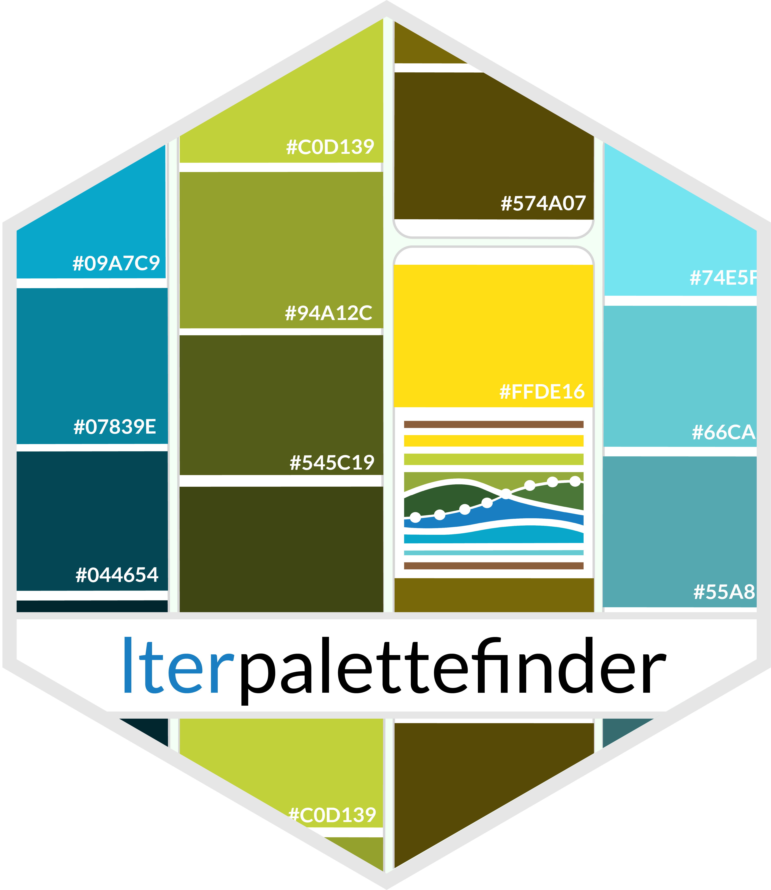

# `lterpalettefinder` R Shiny App

This app is meant to allow non-R users to experiment with `lterpalettefinder`'s functionality in a browser-based format. Hopefully this inspires R users to use this package while allowing those who do not use R to still gather hexadecimal codes for their own subsequent use elsewhere.

## Additional Resources

-   To see the code for `lterpalettefinder` visit its [GitHub repository](https://github.com/lter/lterpalettefinder#readme)
    -   The README identifies all current functions and briefly descrbes their utility
